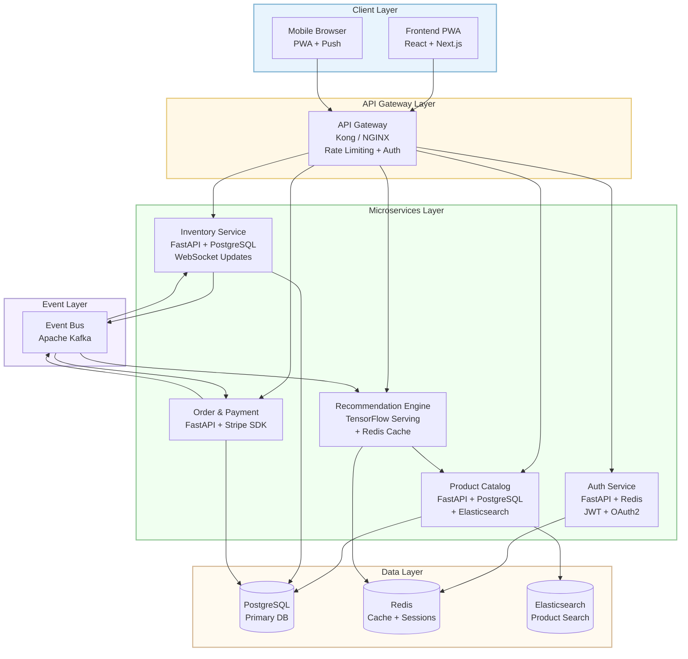
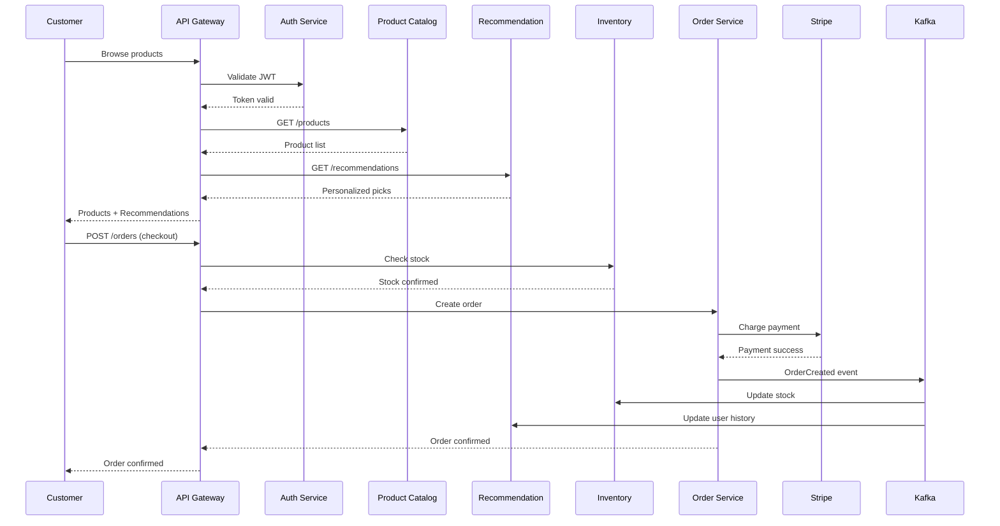
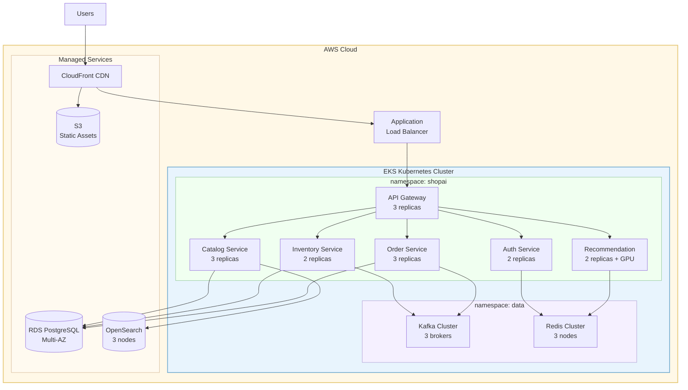
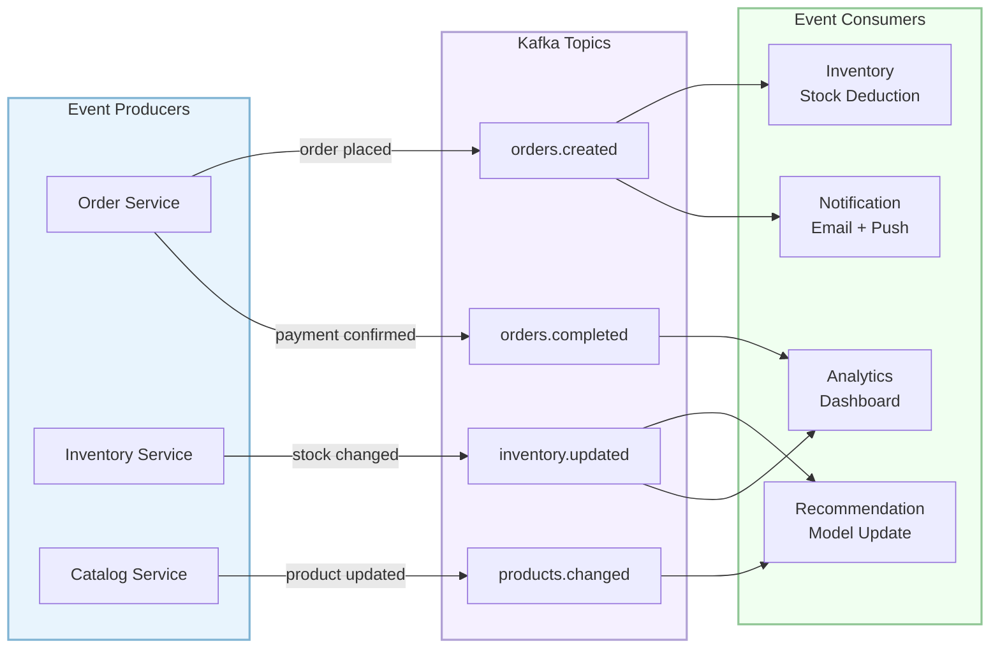
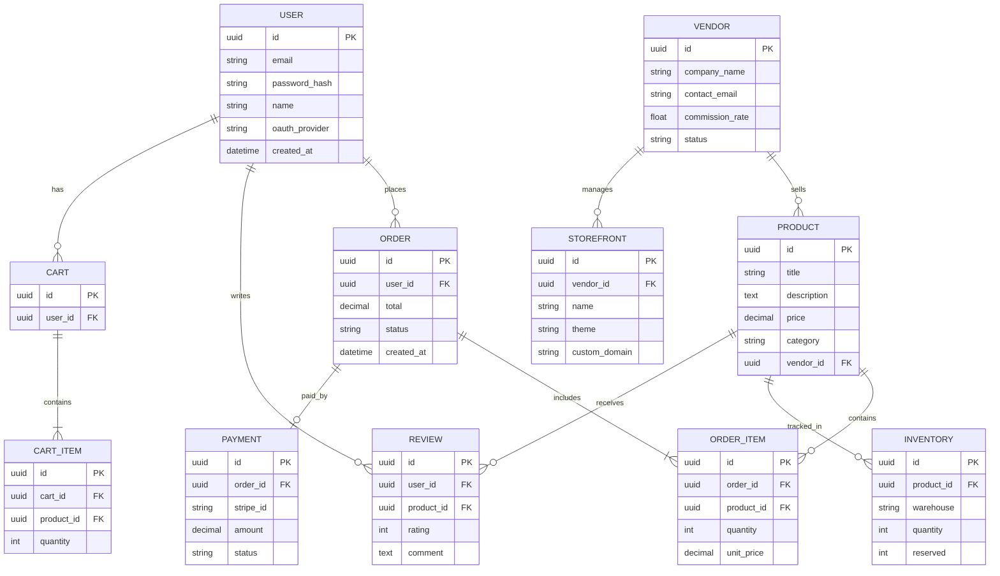

# ShopAI E-Commerce Platform

_A modern e-commerce platform with AI-powered product recommendations, real-time inventory management, multi-vendor support, and a mobile-first responsive design_

**Version:** 0.1.0  

**Generated:** 2026-04-20 18:59

---
## 1. Requirements

| ID | Title | Type | Priority | Status |
|---|---|---|---|---|
| REQ-001 | User Authentication & Authorization | functional | high | not_started |
| REQ-002 | AI Product Recommendations | functional | high | not_started |
| REQ-003 | Real-Time Inventory Management | functional | high | not_started |
| REQ-004 | Multi-Vendor Marketplace | functional | medium | not_started |
| REQ-005 | Mobile-First Responsive Design | functional | high | not_started |
| REQ-006 | Payment Processing & Security | non_functional | high | not_started |
| REQ-007 | Performance & Scalability | non_functional | medium | not_started |

### Use Cases

#### UC-001: Customer Purchases Product

- **Actor:** Customer
- **Main Flow:**
  1. Customer browses product catalog
  2. AI recommends related products
  3. Customer adds items to cart
  4. Customer completes checkout with payment
  5. System updates inventory in real-time

#### UC-002: Vendor Manages Storefront

- **Actor:** Vendor
- **Main Flow:**
  1. Vendor logs into vendor portal
  2. Vendor adds/edits product listings
  3. Vendor views sales analytics dashboard
  4. Vendor manages inventory levels
  5. System calculates commission

#### UC-003: Admin Monitors Platform

- **Actor:** Admin
- **Main Flow:**
  1. Admin views real-time dashboard
  2. Admin reviews vendor applications
  3. Admin configures AI model parameters
  4. Admin monitors system performance
  5. Admin manages user accounts

#### UC-004: Customer Uses Mobile App

- **Actor:** Customer
- **Main Flow:**
  1. Customer opens PWA on mobile
  2. App loads from cache if offline
  3. Customer receives push notification for deals
  4. Customer browses with touch-optimized UI
  5. Customer completes purchase via mobile payment

### AI Analysis

7 requirements extracted covering core e-commerce, AI, inventory, multi-vendor, mobile, security, and performance needs.

---
## 2. Team & Roles

| ID | Name | Role | Skills |
|---|---|---|---|
| TM-001 | Tech Lead / Architect | architect | System Design, Python, Cloud Architecture |
| TM-002 | Senior Backend Developer | developer | Python, FastAPI, PostgreSQL |
| TM-003 | Frontend Developer | developer | React, TypeScript, PWA |
| TM-004 | ML/AI Engineer | developer | Python, TensorFlow, Recommendation Systems |
| TM-005 | DevOps Engineer | devops | Kubernetes, Terraform, CI/CD |
| TM-006 | QA Engineer | qa_engineer | Selenium, pytest, Load Testing |
| TM-007 | Product Owner | project_manager | Agile, User Stories, Stakeholder Mgmt |

---
## 3. Architecture

### Components

| ID | Name | Type | Technology | Dependencies |
|---|---|---|---|---|
| COMP-001 | API Gateway | gateway | Kong / NGINX |  |
| COMP-002 | Auth Service | service | Python FastAPI + Redis | COMP-001 |
| COMP-003 | Product Catalog Service | service | Python FastAPI + PostgreSQL + Elasticsearch | COMP-002 |
| COMP-004 | Recommendation Engine | service | Python + TensorFlow Serving + Redis | COMP-003 |
| COMP-005 | Inventory Service | service | Python FastAPI + PostgreSQL + WebSockets | COMP-003 |
| COMP-006 | Order & Payment Service | service | Python FastAPI + Stripe SDK | COMP-002, COMP-005 |
| COMP-007 | Frontend PWA | frontend | React + Next.js + TailwindCSS | COMP-001 |
| COMP-008 | Event Bus | queue | Apache Kafka / RabbitMQ |  |

### Tech Stack

- **backend:** Python FastAPI
- **cache:** Redis
- **database:** PostgreSQL
- **frontend:** React + Next.js
- **infrastructure:** AWS + Kubernetes
- **messaging:** Kafka
- **ml:** TensorFlow
- **search:** Elasticsearch

### Architecture Decision Records

#### ADR-001: Microservices over Monolith

- **Context:** Need independent scaling of AI, inventory, and order services
- **Decision:** Adopt microservices architecture with API gateway pattern
- **Consequences:** 
- **Status:** accepted

#### ADR-002: Event-Driven Communication

- **Context:** Services need loose coupling for inventory updates and order events
- **Decision:** Use Kafka for async event streaming between services
- **Consequences:** 
- **Status:** accepted

#### ADR-003: PWA over Native Mobile Apps

- **Context:** Budget constraints and need for cross-platform support
- **Decision:** Build as PWA with Next.js for SSR and offline capabilities
- **Consequences:** 
- **Status:** accepted

### Diagrams

#### System Architecture - Microservices Overview

#### Service Communication - Purchase Flow

#### Deployment Architecture - AWS EKS

#### Event-Driven Data Flow

#### Database Schema - Entity Relationship

### Architecture Review

Microservices architecture with event-driven communication, optimized for scalability and independent deployment.

---
## 4. Development

| ID | Title | Component | Priority | Hours | Status |
|---|---|---|---|---|---|
| TASK-001 | Setup API Gateway & routing | COMP-001 | high | 16.0 | backlog |
| TASK-002 | Implement Auth Service (JWT + OAuth2) | COMP-002 | high | 32.0 | backlog |
| TASK-003 | Build Product Catalog CRUD + Search | COMP-003 | high | 40.0 | backlog |
| TASK-004 | Train & deploy recommendation model | COMP-004 | medium | 60.0 | backlog |
| TASK-005 | Implement real-time inventory tracking | COMP-005 | high | 32.0 | backlog |
| TASK-006 | Build Order/Payment processing | COMP-006 | high | 48.0 | backlog |
| TASK-007 | Develop Frontend PWA shell + routing | COMP-007 | high | 40.0 | backlog |
| TASK-008 | Setup Kafka event bus & consumers | COMP-008 | medium | 24.0 | backlog |
| TASK-009 | E2E testing & load testing | COMP-001 | medium | 32.0 | backlog |
| TASK-010 | Vendor portal frontend | COMP-007 | medium | 36.0 | backlog |

### Coding Standards

PEP 8, Black formatter, type hints required, 80% test coverage minimum

### Branching Strategy

GitFlow with feature branches, develop, and main

---
## 5. Deployment

### Environments

| Name | Type | URL |
|---|---|---|
| Development | development | https://dev.shopai.example.com |
| Staging | staging | https://staging.shopai.example.com |
| Production | production | https://shopai.example.com |

### CI/CD Pipeline

1. **Lint & Type Check** — quality
2. **Unit Tests** — test
3. **Build Docker Images** — build
4. **Integration Tests** — test
5. **Deploy to Staging** — deploy
6. **Smoke Tests** — test
7. **Deploy to Production** — deploy

---
## 6. Schedule

### Milestones

| ID | Name | Target Date | Deliverables |
|---|---|---|---|
| MS-001 | MVP — Core Shopping Flow | 2026-06-14 | Auth Service, Product Catalog, Basic Frontend |
| MS-002 | AI & Vendor Features | 2026-07-12 | Recommendation Engine, Vendor Portal, Real-time Inventory |
| MS-003 | Production Launch | 2026-07-26 | Performance Optimization, Security Audit, Production Deployment |

### Sprint Plan

#### Sprint 1: Foundation

- **Tasks:** TASK-001, TASK-002, TASK-007
- **Goals:** API Gateway setup, Auth service MVP, Frontend shell

#### Sprint 2: Core Commerce

- **Tasks:** TASK-003, TASK-005, TASK-008
- **Goals:** Product catalog, Inventory service, Event bus

#### Sprint 3: Payments & Vendors

- **Tasks:** TASK-006, TASK-010
- **Goals:** Order/payment processing, Vendor portal

#### Sprint 4: AI & Intelligence

- **Tasks:** TASK-004
- **Goals:** Train recommendation model, Deploy ML pipeline

#### Sprint 5: Polish & Testing

- **Tasks:** TASK-009
- **Goals:** E2E testing, Load testing, Performance tuning

#### Sprint 6: Launch Prep

- **Tasks:** 
- **Goals:** Security audit, Production deployment, Monitoring setup

**Estimated Duration:** 12 weeks
