# Rational AI — Architecture Document

> **AI-Powered Software Engineering Lifecycle Platform**
> Inspired by IBM Rational Rose, rebuilt for the AI era.

---

## 1. System Overview

Rational AI is a CLI-driven platform that orchestrates the entire software development lifecycle through specialized AI agents. Each lifecycle phase — from requirements gathering to deployment planning — is handled by a dedicated agent that produces structured, traceable artifacts.

### 1.1 High-Level Architecture

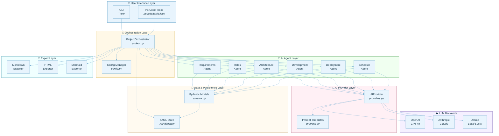

_See also: [system-overview.svg](svg/system-overview.svg)_

---

## 2. Lifecycle Pipeline

The platform follows a sequential 6-phase pipeline, where each phase enriches the unified `Project` model. Phases can run individually or in sequence via `rai full`.

### 2.1 Phase Flow

```mermaid
%%{init: {'theme': 'base', 'themeVariables': { 'primaryColor': '#E8F4FD', 'primaryTextColor': '#1B3A4B', 'primaryBorderColor': '#7FB3D3', 'lineColor': '#7FB3D3', 'secondaryColor': '#FFF8E7', 'tertiaryColor': '#F0FFF0', 'background': '#FFFFFF' }}}%%
flowchart LR
    INPUT["📝 Project<br/>Description"] --> REQ

    subgraph PIPELINE["Software Lifecycle Pipeline"]
        direction LR
        REQ["1️⃣ Requirements<br/><b>Extract & Analyze</b><br/><i>REQ-001..N</i><br/><i>UC-001..N</i>"]
        ROLES["2️⃣ Roles<br/><b>Team Composition</b><br/><i>RACI Matrix</i><br/><i>Skill Mapping</i>"]
        ARCH["3️⃣ Architecture<br/><b>Design & Review</b><br/><i>Components</i><br/><i>ADRs, Diagrams</i>"]
        DEV["4️⃣ Development<br/><b>Task Breakdown</b><br/><i>TASK-001..N</i><br/><i>Code Scaffold</i>"]
        DEPLOY["5️⃣ Deployment<br/><b>CI/CD & IaC</b><br/><i>Environments</i><br/><i>Pipeline</i>"]
        SCHED["6️⃣ Schedule<br/><b>Plan & Estimate</b><br/><i>Milestones</i><br/><i>Sprints</i>"]

        REQ --> ROLES --> ARCH --> DEV --> DEPLOY --> SCHED
    end

    SCHED --> OUTPUT["📊 Reports<br/>& Exports"]

    style INPUT fill:#E8F4FD,stroke:#7FB3D3,stroke-width:2px
    style OUTPUT fill:#E8F4FD,stroke:#7FB3D3,stroke-width:2px
    style PIPELINE fill:#FAFFFE,stroke:#90C695,stroke-width:2px
    style REQ fill:#DCEEFB,stroke:#7FB3D3,stroke-width:1px
    style ROLES fill:#FFF8E7,stroke:#E6C97A,stroke-width:1px
    style ARCH fill:#E8FFE8,stroke:#90C695,stroke-width:1px
    style DEV fill:#FFF0F5,stroke:#D4A0B0,stroke-width:1px
    style DEPLOY fill:#F5F0FF,stroke:#B0A0D4,stroke-width:1px
    style SCHED fill:#FFFAF0,stroke:#D4B896,stroke-width:1px
```

_See also: [lifecycle-pipeline.svg](svg/lifecycle-pipeline.svg)_

---

## 3. Component Architecture

### 3.1 Package Structure

```
rational_ai/
├── __init__.py              # Package root, version
├── cli.py                   # Typer CLI — user-facing commands
├── config.py                # Configuration management (YAML + env vars)
├── project.py               # ProjectOrchestrator — lifecycle coordinator
│
├── ai/                      # AI abstraction layer
│   ├── providers.py         # AIProvider — unified LLM interface
│   ├── prompts.py           # Curated prompt templates per phase
│   └── agents.py            # 6 specialized AI agents
│
├── models/
│   └── schema.py            # Pydantic v2 data models (30+ types)
│
├── phases/                  # Phase execution modules
│   ├── requirements.py      # Gather, analyze, display, save/load
│   ├── roles.py             # Recommend, assign, RACI
│   ├── architecture.py      # Design, review, diagrams, ADRs
│   ├── development.py       # Tasks, scaffolding, standards
│   ├── deployment.py        # Environments, pipelines, IaC
│   └── scheduling.py        # Milestones, sprints, critical path
│
├── exporters/               # Output renderers
│   ├── markdown.py          # Full project → Markdown report
│   ├── html.py              # Full project → interactive HTML
│   └── mermaid.py           # Diagrams → .mmd files + HTML viewer
│
└── utils/
    └── files.py             # YAML read/write helpers
```

### 3.2 Component Dependency Diagram

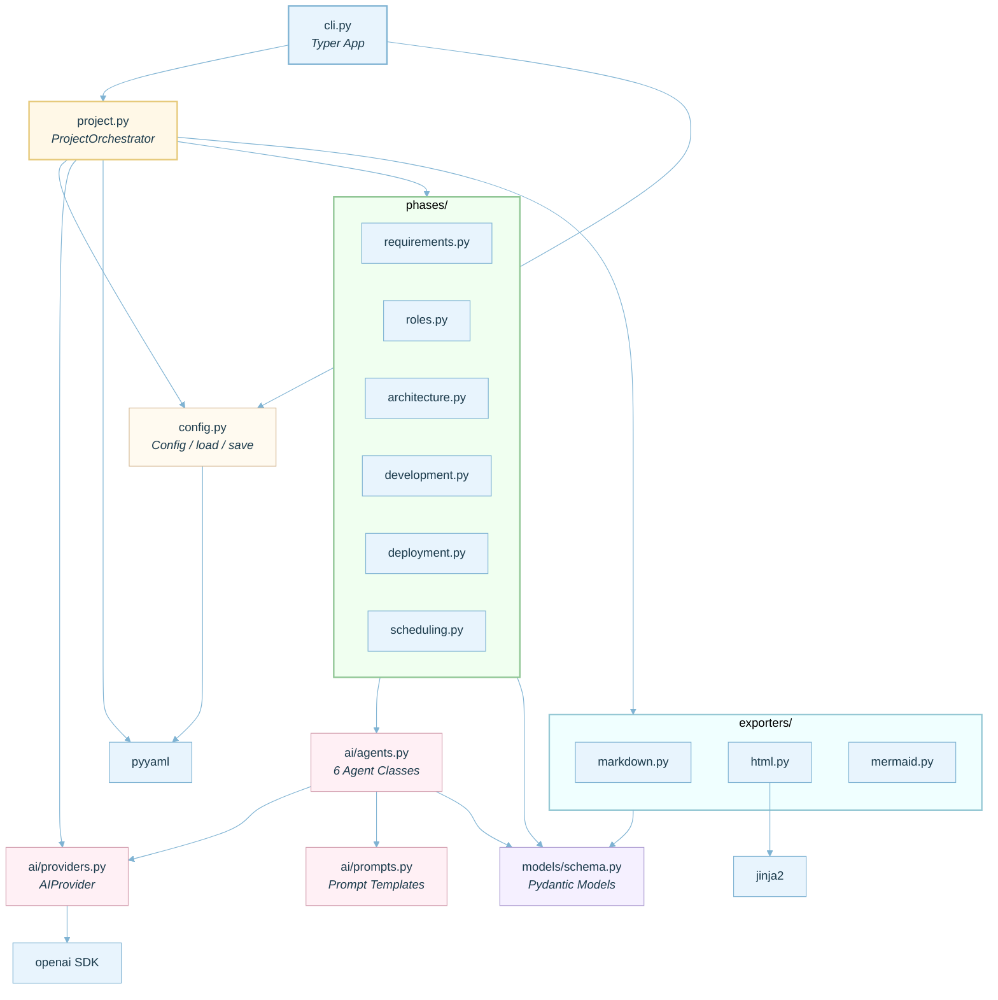

_See also: [component-dependencies.svg](svg/component-dependencies.svg)_

---

## 4. Data Model Architecture

### 4.1 Unified Project Model

The `Project` model is the central data structure that accumulates artifacts from every phase. It is serialized to YAML in `.rai/project.yaml`.

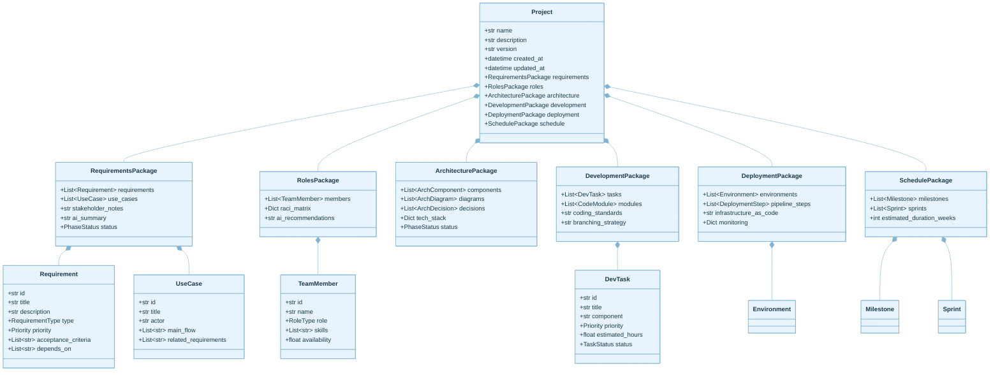

_See also: [data-model.svg](svg/data-model.svg)_

---

## 5. AI Integration Architecture

### 5.1 Provider Abstraction

The `AIProvider` class wraps the OpenAI SDK and provides a unified interface to any OpenAI-compatible API (OpenAI, Anthropic via proxy, Ollama, LM Studio, vLLM).

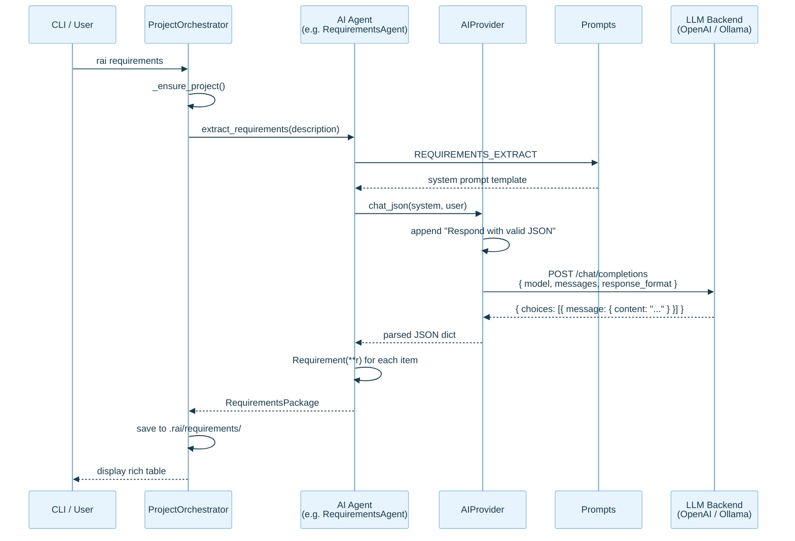

_See also: [ai-sequence.svg](svg/ai-sequence.svg)_

### 5.2 Agent Specialization

Each agent encapsulates domain expertise through curated prompts:

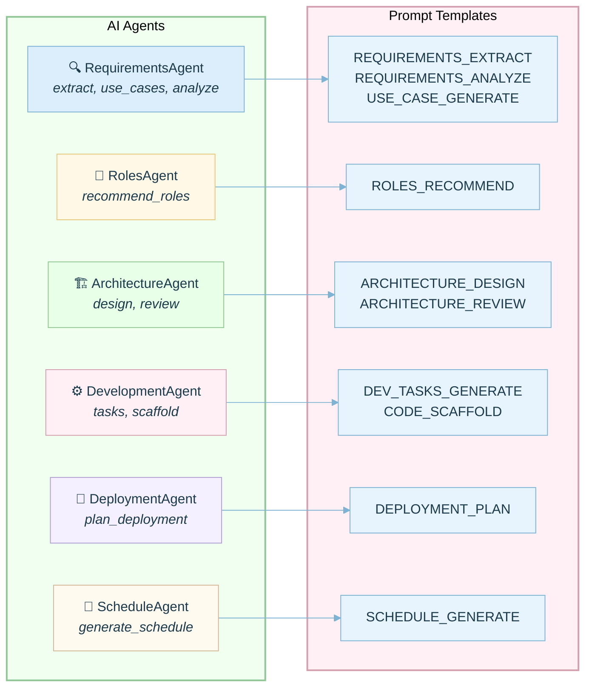

_See also: [agent-specialization.svg](svg/agent-specialization.svg)_

---

## 6. Persistence & State Architecture

### 6.1 Project Directory Layout

```mermaid
%%{init: {'theme': 'base', 'themeVariables': { 'primaryColor': '#E8F4FD', 'primaryTextColor': '#1B3A4B', 'primaryBorderColor': '#7FB3D3', 'lineColor': '#7FB3D3', 'background': '#FFFFFF' }}}%%
graph TD
    ROOT[".rai/"] --> PROJ["project.yaml<br/><i>Unified project state</i>"]
    ROOT --> CONF["config.yaml<br/><i>AI provider settings</i>"]
    ROOT --> REQ_DIR["requirements/"]
    ROOT --> ROLES_DIR["roles/"]
    ROOT --> ARCH_DIR["architecture/"]
    ROOT --> DEV_DIR["development/"]
    ROOT --> DEP_DIR["deployment/"]
    ROOT --> SCHED_DIR["schedule/"]
    ROOT --> EXP_DIR["exports/"]

    REQ_DIR --> REQ_F["requirements.yaml"]
    ROLES_DIR --> ROL_F["roles.yaml"]
    ARCH_DIR --> ARCH_F["architecture.yaml"]
    ARCH_DIR --> DIA1["DIA-001.mmd"]
    ARCH_DIR --> DIA2["DIA-002.mmd"]
    DEV_DIR --> DEV_F["development.yaml"]
    DEP_DIR --> DEP_F["deployment.yaml"]
    SCHED_DIR --> SCHED_F["schedule.yaml"]
    EXP_DIR --> MD_F["report.md"]
    EXP_DIR --> HTML_F["report.html"]
    EXP_DIR --> DIA_DIR["diagrams/"]

    style ROOT fill:#FFF8E7,stroke:#E6C97A,stroke-width:2px
    style PROJ fill:#DCEEFB,stroke:#7FB3D3,stroke-width:1px
    style CONF fill:#DCEEFB,stroke:#7FB3D3,stroke-width:1px
    style REQ_DIR fill:#F0FFF0,stroke:#90C695,stroke-width:1px
    style ROLES_DIR fill:#F0FFF0,stroke:#90C695,stroke-width:1px
    style ARCH_DIR fill:#F0FFF0,stroke:#90C695,stroke-width:1px
    style DEV_DIR fill:#F0FFF0,stroke:#90C695,stroke-width:1px
    style DEP_DIR fill:#F0FFF0,stroke:#90C695,stroke-width:1px
    style SCHED_DIR fill:#F0FFF0,stroke:#90C695,stroke-width:1px
    style EXP_DIR fill:#F0FFFF,stroke:#96C8D4,stroke-width:1px
```

_See also: [persistence-layout.svg](svg/persistence-layout.svg)_

### 6.2 State Flow

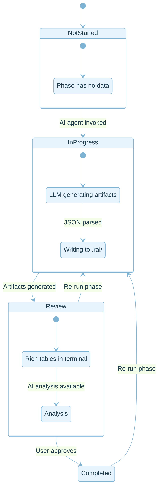

_See also: [state-flow.svg](svg/state-flow.svg)_

---

## 7. CLI Command Architecture

```mermaid
%%{init: {'theme': 'base', 'themeVariables': { 'primaryColor': '#E8F4FD', 'primaryTextColor': '#1B3A4B', 'primaryBorderColor': '#7FB3D3', 'lineColor': '#7FB3D3', 'background': '#FFFFFF' }}}%%
graph TD
    RAI["<b>rai</b><br/><i>Typer CLI</i>"]

    RAI --> INIT["<b>init</b><br/><i>name, --desc, --provider, --model</i>"]
    RAI --> FULL["<b>full</b><br/><i>--desc, --notes</i><br/>Run all 6 phases"]

    RAI --> P_REQ["<b>requirements</b><br/><i>--desc, --notes</i>"]
    RAI --> P_TEAM["<b>team</b>"]
    RAI --> P_ARCH["<b>architecture</b>"]
    RAI --> P_REV["<b>review</b>"]
    RAI --> P_DEV["<b>development</b>"]
    RAI --> P_DEP["<b>deployment</b>"]
    RAI --> P_SCHED["<b>schedule</b>"]

    RAI --> SCAFFOLD["<b>scaffold</b><br/><i>component_id</i>"]
    RAI --> EXPORT["<b>export</b><br/><i>markdown|html|diagrams|all</i>"]
    RAI --> STATUS["<b>status</b>"]
    RAI --> SHOW["<b>show</b><br/><i>phase_name</i>"]

    style RAI fill:#E8F4FD,stroke:#7FB3D3,stroke-width:2px
    style INIT fill:#FFF8E7,stroke:#E6C97A,stroke-width:1px
    style FULL fill:#E8FFE8,stroke:#90C695,stroke-width:2px
    style P_REQ fill:#DCEEFB,stroke:#7FB3D3,stroke-width:1px
    style P_TEAM fill:#DCEEFB,stroke:#7FB3D3,stroke-width:1px
    style P_ARCH fill:#DCEEFB,stroke:#7FB3D3,stroke-width:1px
    style P_REV fill:#DCEEFB,stroke:#7FB3D3,stroke-width:1px
    style P_DEV fill:#DCEEFB,stroke:#7FB3D3,stroke-width:1px
    style P_DEP fill:#DCEEFB,stroke:#7FB3D3,stroke-width:1px
    style P_SCHED fill:#DCEEFB,stroke:#7FB3D3,stroke-width:1px
    style SCAFFOLD fill:#F5F0FF,stroke:#B0A0D4,stroke-width:1px
    style EXPORT fill:#F0FFFF,stroke:#96C8D4,stroke-width:1px
    style STATUS fill:#FFFAF0,stroke:#D4B896,stroke-width:1px
    style SHOW fill:#FFFAF0,stroke:#D4B896,stroke-width:1px
```

_See also: [cli-commands.svg](svg/cli-commands.svg)_

---

## 8. Export Pipeline

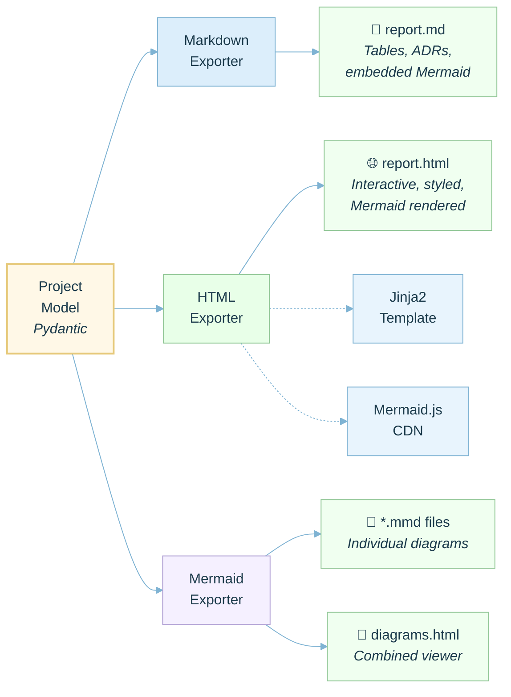

_See also: [export-pipeline.svg](svg/export-pipeline.svg)_

---

## 9. Technology Stack

| Layer             | Technology        | Purpose                         |
| ----------------- | ----------------- | ------------------------------- |
| **Language**      | Python 3.11+      | Core platform                   |
| **CLI Framework** | Typer             | Command-line interface          |
| **Terminal UI**   | Rich              | Tables, panels, colored output  |
| **Data Models**   | Pydantic v2       | Validation, serialization       |
| **AI SDK**        | OpenAI Python SDK | LLM communication               |
| **HTTP**          | httpx             | HTTP client (OpenAI dependency) |
| **Templates**     | Jinja2            | HTML report rendering           |
| **Serialization** | PyYAML            | Project state persistence       |
| **Diagrams**      | Mermaid           | Architecture visualization      |
| **Build**         | Hatchling         | Python packaging                |

---

## 10. IBM Rational Rose Mapping

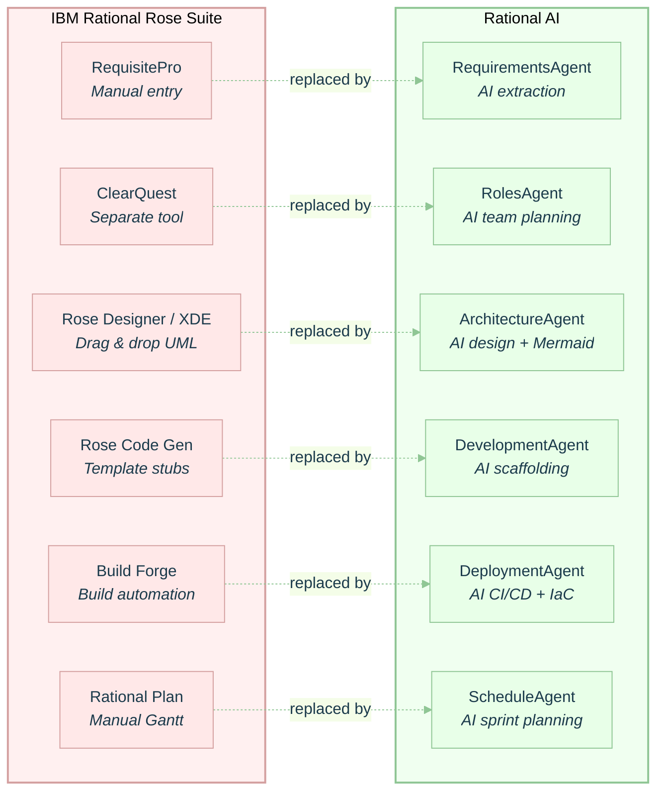

_See also: [rational-rose-mapping.svg](svg/rational-rose-mapping.svg)_

---

## 11. Security Considerations

| Area                 | Approach                                                             |
| -------------------- | -------------------------------------------------------------------- |
| **API Keys**         | Never stored in config files; loaded from `RAI_API_KEY` env var only |
| **Data at Rest**     | YAML files are local, human-readable, no encryption by default       |
| **LLM Data**         | With Ollama/local models, no data leaves the machine                 |
| **Input Validation** | All AI outputs parsed through Pydantic strict validation             |
| **Code Generation**  | Scaffolds reviewed before execution; no auto-execute                 |
| **Dependencies**     | Minimal dependency tree; pinned versions via `pyproject.toml`        |

---

## 12. Extensibility

| Extension Point     | How                                                                         |
| ------------------- | --------------------------------------------------------------------------- |
| **New AI Provider** | Implement OpenAI-compatible endpoint, set `base_url` in config              |
| **New Phase**       | Add module in `phases/`, agent in `ai/agents.py`, prompt in `ai/prompts.py` |
| **New Exporter**    | Add module in `exporters/`, register in `ProjectOrchestrator`               |
| **Custom Prompts**  | Override templates in `ai/prompts.py` for domain-specific tuning            |
| **VS Code Tasks**   | Add entries to `.vscode/tasks.json` for custom workflows                    |

---

_Generated for Rational AI v0.1.0_
